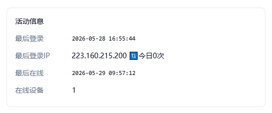

## Xboard添加拉去次数和订阅ip

### 效果展示



### 修改表字段属性

> 登录你的xboard数据，执行以下代码
```sql
ALTER TABLE v2_user MODIFY last_login_ip VARCHAR(45);
```
### 覆盖文件中的方法

> 在以下两个文件中头部导入 `use Illuminate\Support\Facades\Cache;`


> 将下方fetch复制到 `app/Http/Controllers/V2/Admin/UserController.php` 替换原本的 `fetch` 方法


```php
public function fetch(Request $request)
{
	$current = $request->input('current', 1);
	$pageSize = $request->input('pageSize', 10);

	$userModel = User::query()
		->with(['plan:id,name', 'invite_user:id,email', 'group:id,name'])
		->select((new User())->getTable() . '.*')
		->selectRaw('(u + d) as total_used');
		
	$this->applyFiltersAndSorts($request, $userModel);

	$users = $userModel->orderBy('id', 'desc')
		->paginate($pageSize, ['*'], 'page', $current);
	
	$users->getCollection()->transform(function ($user): array {
		
		// ==============================
		// 📌 获取当天该用户拉取订阅次数
		// ==============================
		$pullKey = 'subscribe_pull_count_' . now()->format('Ymd') . '_' . $user->id;
		$pullCount = Cache::get($pullKey, 0);

		if ($user->last_login_ip) {
			$user->last_login_ip = "{$user->last_login_ip} 🔃今日{$pullCount}次";
		}else{
			$user->last_login_ip = "🔃今日{$pullCount}次";
		}
	
		return self::transformUserData($user);
	});

	return $this->paginate($users);
}
```


> 将下方fetch复制到 `app/Http/Controllers/V1/Client/ClientController.php` 替换原本的 `subscribe` 方法


```php
public function subscribe(Request $request)
{

	// ==============================
	// 📌 Hook（防止影响主流程）
	// ==============================
	HookManager::call('client.subscribe.before');


	// ==============================
	// 📌 参数校验
	// ==============================
	$request->validate([
		'types' => ['nullable', 'string'],
		'filter' => ['nullable', 'string'],
		'flag' => ['nullable', 'string'],
	]);
	
	// ==============================
	// 📌 获取用户与 IP
	// ==============================
	$user = $request->user();

	// 是否套了CloudFlare
	$ip = $request->header('CF-Connecting-IP');

	// 没套就继续深挖是否有反代/nginx等
	if (!$ip) {
		$forwarded = $request->header('X-Forwarded-For');
        
		if ($forwarded) {
                $ip = trim(explode(',', $forwarded)[0]);
		}
	}
        
	// 什么都没有兜底
	$ip = $ip ?: $request->ip();
	
	// ==============================
	// 📌 当天订阅拉取次数统计（安全版）
	// ==============================
	$pullKey = 'subscribe_pull_count_' . now()->format('Ymd') . '_' . $user->id;

	if (!Cache::has($pullKey)) {
		Cache::put($pullKey, 0, now()->endOfDay());
	}

	$pullCount = Cache::increment($pullKey);

	// ==============================
	// 📌 IP 仅在变化时更新
	// ==============================
	if ($user->last_login_ip !== $ip) {
		$user->last_login_ip = $ip;
		$user->save();
	}

	// ==============================
	// 📌 用户可用性检查
	// ==============================
	$userService = new UserService();

	if (!$userService->isAvailable($user)) {
		HookManager::call('client.subscribe.unavailable');
		return response('', 403, ['Content-Type' => 'text/plain']);
	}

	// ==============================
	// 📌 正常返回订阅
	// ==============================
	return $this->doSubscribe($request, $user);
}
```

